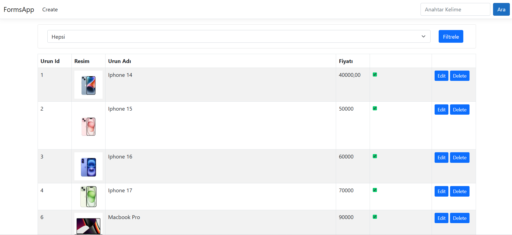
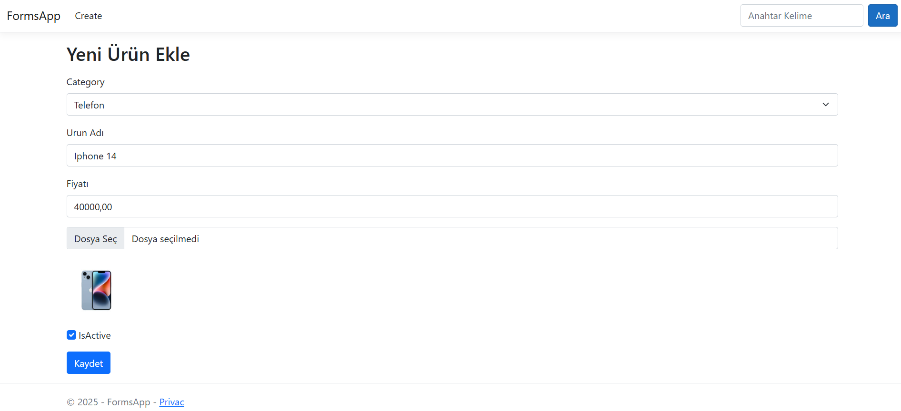
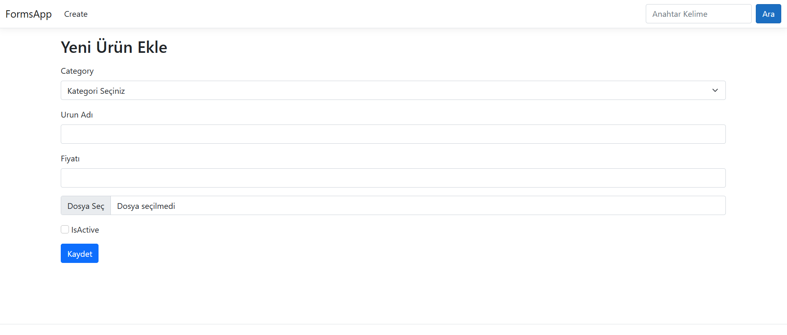
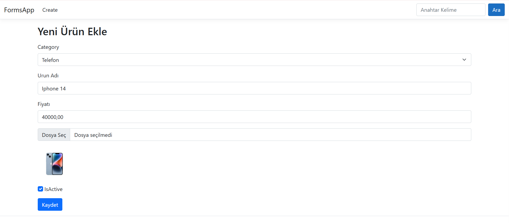
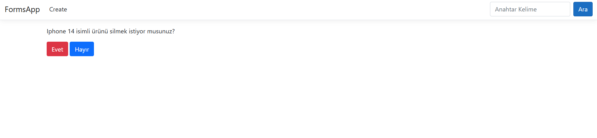

🧾 FormsApp – Basit Ürün Yönetim Sistemi
FormsApp, ASP.NET Core MVC ile geliştirilmiş bir ürün yönetim uygulamasıdır. Uygulama içerisinde iki farklı ürün kategorisi bulunmaktadır: Bilgisayar ve Telefon. Kullanıcılar bu ürünleri görüntüleyebilir, düzenleyebilir, silebilir veya yeni ürünler ekleyebilir.

🚀 Özellikler
🔍 Kategoriye Göre Filtreleme
Ürünleri "Bilgisayar" ve "Telefon" kategorilerine göre filtreleyerek hızlıca aradığınız ürüne ulaşabilirsiniz.

💵 Fiyat Bilgisi
Ürünlerin fiyat bilgileri listede gösterilir.

✅ Aktiflik Durumu
Her ürünün aktif olup olmadığı görüntülenebilir.

📝 Ürün Güncelleme (Edit)
Mevcut ürünler üzerinde düzenleme yapılabilir.

🗑️ Ürün Silme
Gereksiz ürünler kolayca sistemden silinebilir.

➕ Yeni Ürün Ekleme
Kullanıcılar form aracılığıyla sisteme yeni ürünler ekleyebilir.

🛠️ Kullanılan Teknolojiler
ASP.NET Core MVC

Entity Framework Core

Razor Pages

Bootstrap

C#

Visual Studio

